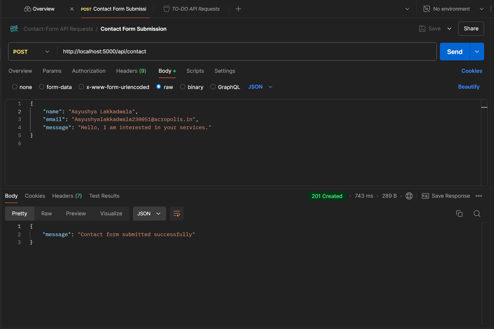
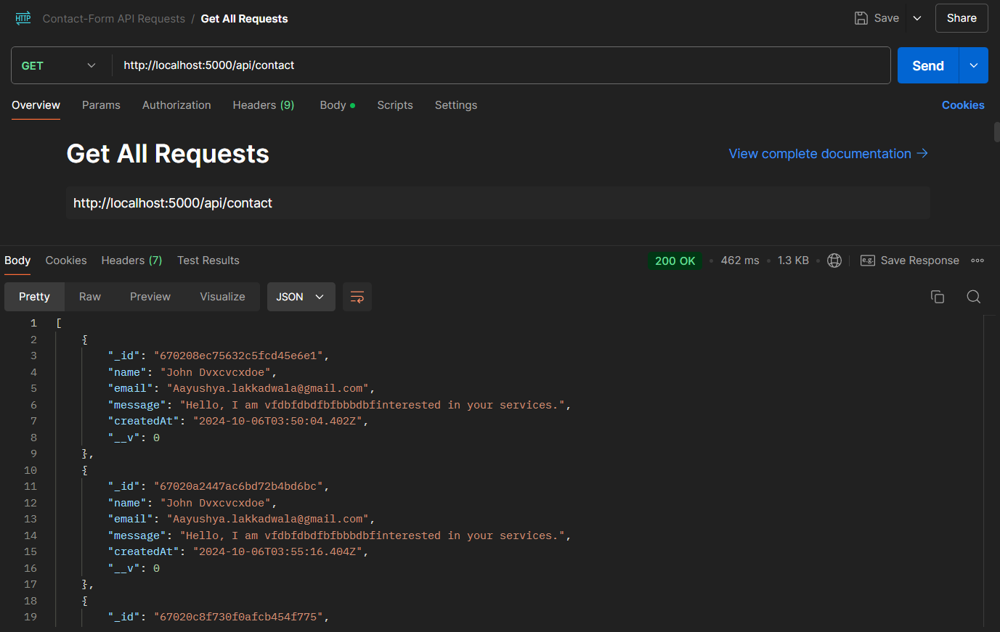
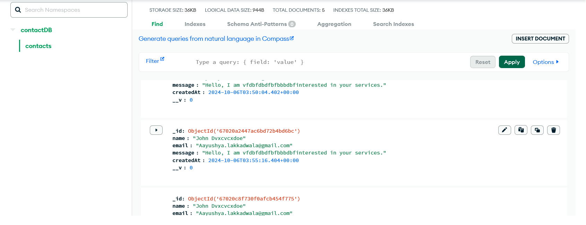
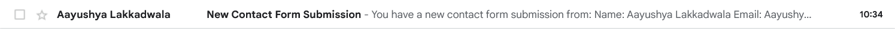
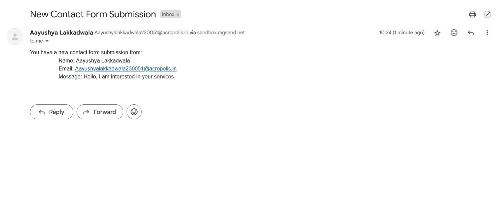

# Contact Form API

## Overview
The Contact Form API allows users to submit their contact information through a web form. The submissions are stored in a MongoDB database and trigger email notifications to the site administrator. This project provides a simple and effective way to manage contact inquiries and ensure timely responses.

## Features
- **Form Submission**: Allows users to submit their name, email, and message.
- **Data Storage**: Stores submissions in a MongoDB database.
- **Email Notifications**: Sends email notifications to the site administrator upon form submission.
- **Retrieve Submissions**: API endpoint to retrieve all contact form submissions.

## Technologies Used
- **Node.js**: JavaScript runtime for building the API.
- **Express.js**: Web framework for Node.js to manage routes and middleware.
- **MongoDB**: NoSQL database for storing contact submissions.
- **Mongoose**: ODM (Object Data Modeling) library for MongoDB and Node.js.
- **Nodemailer**: Module to send emails from Node.js applications.
- **Postman**: API development tool for testing and documenting the API.

## Installation

1. **Clone the Repository**:
   ```bash
   git clone https://github.com/TheGamingGod85/CSI-Web_Dev.git
   cd CSI-Web_Dev
   cd contact-form-api
   ```
2. **Install Dependencies**:
    ```bash
    npm install
    ```
3. **Set Up Environment Variables**:
    Create a `.env` file in the root directory and add the following variables:
    ```
    MONGO_URI=mongodb+srv://<username>:<password>@cluster0.dc8k1.mongodb.net/contactDB?retryWrites=true&w=majority
    ADMIN_EMAIL=your_admin_email@example.com
    MAILGUN_USER=postmaster@sandbox81b5f5f87ff841ab99b3d0333ae2b5c4.mailgun.org
    MAILGUN_PASSWORD=70e6c3cec1bc17dad42b24abdd79a304-3724298e-5e93abc0
    ```
4. **Run the Application**:
    ```bash
    npm start
    ```
## API Endpoints

### Submit a Contact Form (POST)
 - **Endpoint** `/api/contact`
 - **Request Body**:
   ```json
   {
        "name": "John Doe",
        "email": "john@example.com",
        "message": "Hello, I am interested in your services."
    }
    ```
 - **Response**:
    - Success (201):
        ```json
        {
            "message": "Contact form submitted successfully"
        }
        ```
    - Error (400):
        ```json
        {
            "error": "Please provide all required fields"
        }
        ```
### Retrieve All Submissions (GET)
 - **Endpoint** `/api/contact`
 - **Response**:
    ```json
    [
        {
            "_id": "60c72b2f9b1e8a1f8c8e4f30",
            "name": "John Doe",
            "email": "john@example.com",
            "message": "Hello, I am interested in your services.",
            "createdAt": "2024-10-06T12:00:00.000Z",
            "__v": 0
        },
        ...
    ]   
    ```
## Postman Workspace
You can import and test the API using the provided Postman workspace:
[CSI WebDev Postman Workspace](https://www.postman.com/mission-participant-78873652/workspace/csi-web-dev). The name of the account on Postman is different because it was created to reduce spam on my main email.

## Author
**Aayushya Lakkadwala**  
0827CS231008  
CSI Web-Dev Track

### Final Notes
- In Mailgun, sending emails is allowed only to verified emails if you are on the free tier. Since I am not paying for that, although I have attached proofs of my email working, if you want to check it yourself, just hit me an email at aayushyalakkadwala230051@acropolis.in, and I will add that email to the verified emails.
- Make sure to replace the admin email in the `.env` section with your email to check working of email service.

## Proof of Working
- POST Request in Postman

- GET Request in Postman

- Data in MongoDB

- Email Received

- Email Format
